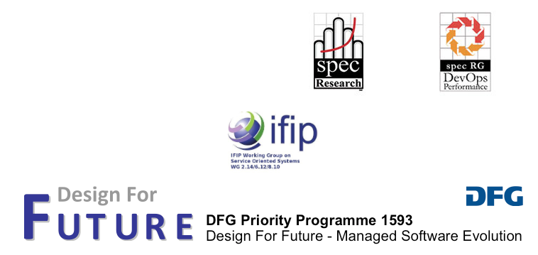

---
# You don't need to edit this file, it's empty on purpose.
# Edit theme's home layout instead if you wanna make some changes
# See: https://jekyllrb.com/docs/themes/#overriding-theme-defaults
layout: page
---

#### 5th International Workshop on Quality-Aware DevOps (QUDOS 2019), joint with the 4th Workshop on Continuous Software Engineering (CSE 2019)

QUDOS 2019 will be held on Mar 26th, 2019 in Hamburg, Germany and will be co-located with the [3rd International Conference on Software Architectures (ICSA 2019)](https://swk-www.informatik.uni-hamburg.de/~icsa2019/).
#
<th class="tg-baqh">NEWS! We are honored to inform you that esteemed Prof. Dr. Ian Gorton will deliver our morning Keynote on "Engineering at Hyperscale - Architectural Issues and Challenges".</th>

#
Download Call for Papers as [PDF](/files/QUDOS2019-CfP-Flyer.pdf) or [TXT](/files/QUDOS2019-CfP.txt).

The QUDOS workshop provides a forum for experts from academia and industry to present and discuss novel quality-aware methods, practices and tools for DevOps.

DevOps extends the agile development principles to include the full stack of software services, from design to execution, enabling and promoting collaboration of operations, quality assurance, and development engineers throughout the entire service lifecycle. Ultimately, DevOps is a process that enables faster releases of a better product to the end user. DevOps encompasses a set of values, principles, methods, practices, and tools, to accelerate software delivery to the customer by means of infrastructure as code, continuous integration and deployment, automated testing and monitoring, or new architectural styles such as microservices. In the end all common software engineering activities, organizational forms and processes have to be questioned, adapted and extended to ensure continuous and unobstructed software development, this is the aim of continuous software engineering (CSE)research. Current software engineering research mainly deals with the development aspects of DevOps and CSE, focusing on development methods, practices, and tools, leaving the quality assurance aspects of DevOps behind.

Even though development practices such as testing (at all levels) are instrumental in producing quality software, they mostly deal with the functional correctness, while quality assurance deals with a more broadly defined concept of quality, of which functional correctness is just one dimension. However, DevOps needs methods and tools that enable systematic assessment, prediction, and management of software quality in other dimensions as well, including performance, reliability, safety, survivability, or cost of ownership.

The QUDOS workshop provides a forum for experts from academia and industry to present and discuss novel quality-aware methods, practices and tools for DevOps. On the other hand, the goal of the CSE workshop is to present and discuss innovative solutions, ideas and experiences in the area of continuity along the entire software engineering lifecycle hence, Continuous Software Engineering. 

QUDOS 2019 is technically sponsored by the Research Group (RG) and the [RG DevOps Performance Working Group](https://research.spec.org/devopswg) of the [Standard Performance Evaluation Corporation (SPEC RG)](http://research.spec.org/), and by the consortium of the EU project RADON. The workshop is supported by the [IFIP Working Group on Service Oriented Systems](http://ifip-wg-sos.deib.polimi.it/), and by the [DFG Priority Programme 1593 (SPP1593) "Design For Future - Managed Software Evolution"](http://www.dfg-spp1593.de/), funded by the German Research Foundation (DFG).

<map name="sponsermap">
<area shape="spec" coords="422,18,500,125" href="https://research.spec.org/" alt="Spec">
<area shape="devops" coords="600,18,670,128" href="https://research.spec.org/devopswg" alt="Spec DevOps">
<area shape="ifip" coords="310,148,458,247" href="http://ifip-wg-sos.deib.polimi.it/" alt="ifip">
<area shape="dfg" coords="27,250,746,346" href="http://www.dfg-spp1593.de/" alt="DFG">
</map> 

<a class="twitter-timeline" href="https://twitter.com/qudos_workshop?ref_src=twsrc%5Etfw">Tweets by qudos_workshop</a>

